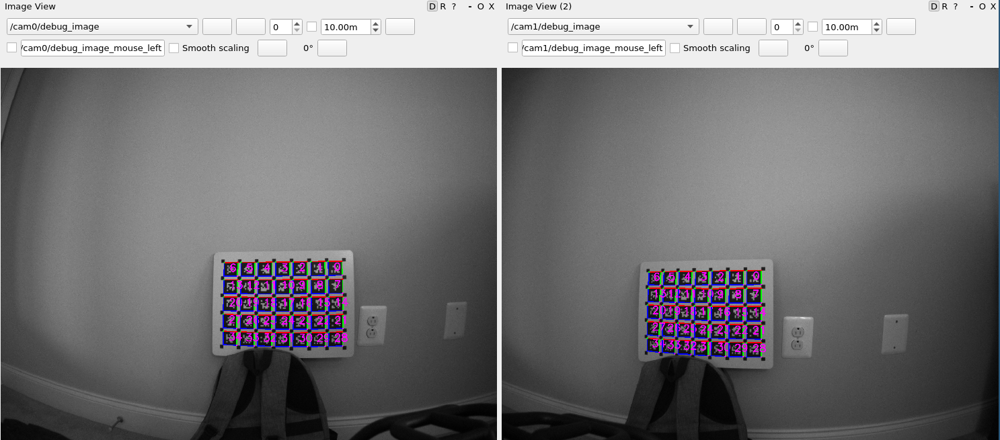

# multicam_calibration - extrinsic and intrinsic calbration of cameras

## Installation

Download the package:
	
	mkdir catkin_ws
	cd catkin_ws
	mkdir src
	cd src
	git clone https://github.com/KumarRobotics/multicam_calibration.git

You will need the following packages in your ROS workspace:

	git clone https://github.com/catkin/catkin_simple
	git clone --recursive https://github.com/versatran01/apriltag.git

And probably libceres:

	sudo apt install libceres-dev

What else you are missing you'll find out now:

	cd catkin_ws
	catkin config -DCMAKE_BUILD_TYPE=Release
	catkin build

## How to use:

First, produce the best starting guess you can come up with,
and edit it into ``calib/example/example_camera-initial.yaml``:

	cam0:
	  camera_model: pinhole
	  intrinsics: [605.054, 604.66, 641.791, 508.728]
	  distortion_model: equidistant
	  distortion_coeffs: [-0.0146915, 0.000370396, -0.00425216, 0.0015107]
	  resolution: [1280, 1024]
	  rostopic: /rig/left/image_mono
	cam1:
	  T_cn_cnm1:
	  - [ 0.99999965648, -0.00013331925,  0.00081808159, -0.19946344647]
	  - [ 0.00013388601,  0.99999975107, -0.00069277676, -0.00005674605]
	  - [-0.00081798903,  0.00069288605,  0.99999942540,  0.00010022941]
	  - [ 0.00000000000,  0.00000000000,  0.00000000000,  1.00000000000]
	  camera_model: pinhole
	  intrinsics: [605.097, 604.321, 698.772, 573.558]
	  distortion_model: equidistant
	  distortion_coeffs: [-0.0146155, -0.00291494, -0.000681981, 0.000221855]
	  resolution: [1280, 1024]
	  rostopic: /rig/right/image_mono

Adjust the topics to match your camera sources.

You must use an aprilgrid target for calibration, layout follows Kalibr conventions and 
is specified in ``config/aprilgrid.yaml``.

Then launch the camera calibration:

	roslaunch multicam_calibration calibration.launch
	
You can see the camera images and the detected tags overlaid with any of the ros
image visualization tools.

There is a sample perspective file in the config directory:

	rqt --perspective-file=config/example.perspective

Then play your calibration bag (or do live calibration):

	rosbag play falcam_rig_2018-01-09-14-28-56.bag

You should see the tags detected, and output like this on the terminal:

	type is multicam_calibration/CalibrationNodelet
	[ INFO] [1515674455.127216052]: added camera: cam0
	[ INFO] [1515674455.130332740]: added camera: cam1
	[ INFO] [1515674455.131238617]: not using approximate sync
	[ INFO] [1515674455.132790610]: writing extracted corners to file corners.csv
	[ INFO] [1515674458.646217104]: frame number:   10, total number of tags found:  349 336
	[ INFO] [1515674459.958243084]: frame number:   20, total number of tags found:  698 686
	[ INFO] [1515674461.349852261]: frame number:   30, total number of tags found:  1048 1036
	... more lines here ....
	[ WARN] [1515674512.667679323]: no detections found, skipping frame!
	[ INFO] [1515674512.757430315]: frame number:  410, total number of tags found:  11896 13300

When you think you have enough frames collected, you can start the calibration:

	rosservice call /multicam_calibration/calibration
	
This should give you output like this:

	Num params: 2476
	Num residuals: 201928
	iter      cost      cost_change  |gradient|   |step|    tr_ratio  tr_radius  ls_iter  iter_time  total_time
	0  4.478809e+03    0.00e+00    5.32e+06   0.00e+00   0.00e+00  1.00e+04        0    2.45e-01    3.10e-01
	1  1.291247e+03    3.19e+03    2.03e+05   1.46e+00   1.55e+00  3.00e+04        1    5.11e-01    8.21e-01
	2  1.288842e+03    2.40e+00    6.22e+03   2.38e-01   1.04e+00  9.00e+04        1    4.56e-01    1.28e+00
	3  1.288794e+03    4.79e-02    3.19e+02   3.57e-02   1.02e+00  2.70e+05        1    4.37e-01    1.71e+00
	4  1.288792e+03    2.27e-03    3.73e+01   7.64e-03   1.01e+00  8.10e+05        1    4.38e-01    2.15e+00
	5  1.288792e+03    2.61e-05    5.09e+00   7.20e-04   1.01e+00  2.43e+06        1    4.38e-01    2.59e+00
	6  1.288792e+03    6.92e-08    5.35e-01   3.46e-05   1.03e+00  7.29e+06        1    4.37e-01    3.03e+00

	Solver Summary (v 1.12.0-eigen-(3.2.92)-lapack-suitesparse-(4.4.6)-cxsparse-(3.1.4)-openmp)

	Original                  Reduced
	Parameter blocks                          410                      410
	Parameters                               2476                     2476
	Residual blocks                           409                      409
	Residual                               201928                   201928

	Minimizer                        TRUST_REGION

	Sparse linear algebra library    SUITE_SPARSE
	Trust region strategy     LEVENBERG_MARQUARDT
	
	Given                     Used
	Linear solver          SPARSE_NORMAL_CHOLESKY   SPARSE_NORMAL_CHOLESKY
	Threads                                     4                        4
	Linear solver threads                       1                        1
	Linear solver ordering              AUTOMATIC                      410
	
	Cost:
	Initial                          4.478809e+03
	Final                            1.288792e+03
	Change                           3.190017e+03
	
	Minimizer iterations                        7
	Successful steps                            7
	Unsuccessful steps                          0
	
	Time (in seconds):
	Preprocessor                           0.0653
	
	Residual evaluation                  0.0680
	Jacobian evaluation                  1.4113
	Linear solver                        1.5961
	Minimizer                              3.2011
	
	Postprocessor                          0.0000
	Total                                  3.2663
	
	Termination:                      CONVERGENCE (Function tolerance reached. |cost_change|/cost: 1.930077e-13 <= 1.000000e-12)
	
	[ INFO] [1515674589.074056064]: writing calibration to /home/pfrommer/Documents/foo/src/multicam_calibration/calib/example/example_camera-2018-01-11-07-43-09.yaml
	cam0:
	camera_model: pinhole
	intrinsics: [604.355, 604.153, 642.488, 508.135]
	distortion_model: equidistant
	distortion_coeffs: [-0.014811, -0.00110814, -0.00137418, 0.000474477]
	resolution: [1280, 1024]
	rostopic: /rig/left/image_mono
	cam1:
	T_cn_cnm1:
	- [ 0.99999720028,  0.00030730438,  0.00234627487, -0.19936845450]
	- [-0.00030303357,  0.99999829718, -0.00182038902,  0.00004464487]
	- [-0.00234683029,  0.00181967292,  0.99999559058,  0.00029671670]
	- [ 0.00000000000,  0.00000000000,  0.00000000000,  1.00000000000]
	camera_model: pinhole
	intrinsics: [604.364, 603.62, 698.645, 573.02]
	distortion_model: equidistant
	distortion_coeffs: [-0.0125438, -0.00503567, 0.00031359, 0.000546495]
	resolution: [1280, 1024]
	rostopic: /rig/right/image_mono
	[ INFO] [1515674589.251025662]: ----------------- reprojection errors: ---------------
	[ INFO] [1515674589.251045482]: total error:     0.283519 px
	[ INFO] [1515674589.251053450]: avg error cam 0: 0.28266 px
	[ INFO] [1515674589.251059520]: avg error cam 1: 0.284286 px
	[ INFO] [1515674589.251070091]: max error: 8.84058 px at frame: 110 for cam: 1
	[ INFO] [1515674589.251410620]: -------------- simple homography test ---------
	[ INFO] [1515674589.331235450]: camera: 0 points: 47700 reproj err: 0.440283
	[ INFO] [1515674589.331257726]: camera: 1 points: 53252 reproj err: 0.761365

In the ``calib/example`` directory you can now find the output of the calibration:

	ls -1
	example_camera-2018-01-11-08-24-22.yaml
	example_camera-initial.yaml
	example_camera-latest.yaml

## Parameters

- ``use_approximate_sync``: (default: false) uses the ROS approximate sync framework to
  approximately synchronize image frames with different message header
  stamps.
- ``corners_file``: if a corners file is specified, such corners file is
  loaded as input data when the calibration node starts up, as if
  these corners had been detected by 
  feeding images to the calibration node. This allows repeating of
  previously done calibrations by keeping the corners file instead of
  all the images. Whenever points are fed into the calibration node,
  it writes the corners to ``~/.ros/corners.csv``.
- ``run_calib_no_init``: run calibration right after loading the
  corners file. This is mostly for debugging purposes.
- ``fix_intrinsics``: fixes all intrinsics. Note that more
  fine-grained fixing of intrinsics for individual cameras can be done
  on the fly with ROS service calls.
- ``record_bag``: was supposed to record the images that were used for
  calibration, but this feature is currently broken due to some ROS
  bug.
- ``outlier_pixel_threshold`` (default: -1). If specified greater than
  0 will remove any detected corners that exceed the error threshold
  and re-run the calibration again. Note: new option, has not seen
  much testing yet.
- ``output_filename``, ``latest_link_name``, ``calib_dir``, and
  ``results_dir`` combined specify where to look for the initial files
  and where the calibration results will go. The parameterization is
  somewhat confusing so it's best to look at the example launch files
  and/or the source code.
- ``detector_type``: (default: ``Mit``) allows to switch between the
  MIT and the ``Umich`` version of the apriltag implementation
- ``tag_border``: (only valid if using the ``Mit`` detector, specifies
  the width of the black border frame of the tags, defaults to 2).

## Managed calibrations

Sometimes a calibration consists of a sequence of steps, for example: first the
intrinsics of each sensor, then the extrinsics of the sensors with
respect to each other. This is particularly useful when image data
between sensors is not synchronized.

To help with this, you can write a little python program that does
that. In fact, you just have to modify the section below in
``src/example_calib_manager.py``, and voila, when you trigger your
calibration manager, it will in turn run multiple calibrations via
service calls into the calibration node, each time retaining the
previous calibration's output as initial value. Here is an example
section, adjust as needed:

        # first do intrinsics of cam0
        set_p(FIX_INTRINSICS, "cam0", False)
        set_p(FIX_EXTRINSICS, "cam0", True)
        set_p(SET_ACTIVE,     "cam0", True)
        set_p(FIX_INTRINSICS, "cam1", True)
        set_p(FIX_EXTRINSICS, "cam1", True)
        set_p(SET_ACTIVE,     "cam1", False)
        run_cal()
        # then do intrinsics of cam1
        set_p(FIX_INTRINSICS, "cam0", True)
        set_p(FIX_EXTRINSICS, "cam0", True)
        set_p(SET_ACTIVE,     "cam0", False)
        set_p(FIX_INTRINSICS, "cam1", False)
        set_p(FIX_EXTRINSICS, "cam1", True)
        set_p(SET_ACTIVE,     "cam1", True)
        run_cal()
        # now extrinsics between the two
        set_p(FIX_INTRINSICS, "cam0", True)
        set_p(FIX_EXTRINSICS, "cam0", True)
        set_p(SET_ACTIVE,     "cam0", True)
        set_p(FIX_INTRINSICS, "cam1", True)
        set_p(FIX_EXTRINSICS, "cam1", False)
        set_p(SET_ACTIVE,     "cam1", True)
        run_cal()

## Unit tests

For unit testing of the calibration code, refer to [this page](test/README.md).

